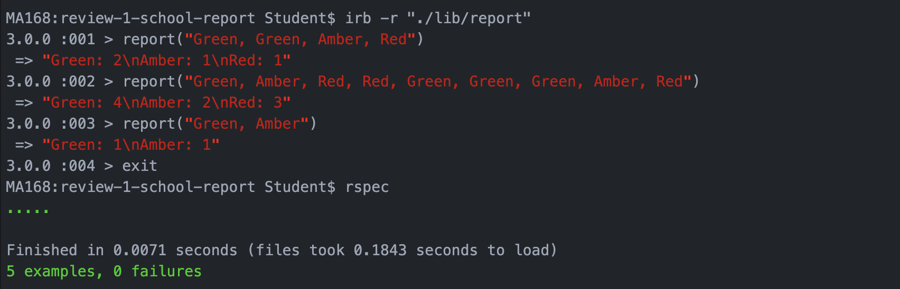

## Client Specification

**Client Brief**: We assess how students did on tests. Will give a string of test results and expect back a report of the grade with a count of how many students have achieved each grade.

### Approach

I asked for an example of the input and the expected output and was given "Green, Amber, Red" ⇒ "Green: 1\n Amber: 1\n Red: 1"

I broke this down into an input/ output table, starting with the simplest possible exmample that may be given and expaning on this step by step:

|           INPUT            |        OUTPUT      |
| -------------------------- | ----------------- |
|"Green"                     |     "Green: 1" |
|"Green, Green"               |      "Green: 2" |
|"Green, Amber"              |     "Green: 1\nAmber: 1" |
|"Green, Amber, Red"         |     "Green: 1\nAmber: 1\nRed:1" |
|"Green, Green, Amber, Red"   |     "Green: 2\nAmber: 1\nRed:1" |

Once i had the basic steps down I started to ask further questions to ensure my table was correct and explore possible edge cases.

I asked asked if the grades would be spelt correctly or if there'd be random grades and was told there may be multiple miscellaneous/ misspelt entries and that I should also return a count of all the grades that had been uncounted. So I added the following input/output:

|           INPUT            |        OUTPUT      |
| -------------------------- | ----------------- |
|"Green,Dave,Whimsy,Red"     |     "Green: 1\nRed: 1\nUncounted: 2" |

Furthermore, as we were dealing with strings i asked if all grades would be consistently capitalised. I was told there would be a mixture of both capitalized and non-capitalised. Also he mentioned that it was possible there would be no spaces within the input. So i added the following:

|           INPUT            |        OUTPUT      |
| -------------------------- | ----------------- |
|"Green, amber, Red"          |      "Green: 1\nAmber: 1\nRed:1" |
"Green,Amber,Red"          |     "Green: 1\nAmber: 1\nRed:1" |

Finally, I was left with this as my input output table:

|           INPUT            |        OUTPUT      |
| -------------------------- | ----------------- |
|"Green"                      |      "Green: 1"|
|"Green, Green"               |      "Green: 2"|
|"Green, Amber"               |      "Green: 1\nAmber: 1"|
|"Green, Amber, Red"          |      "Green: 1\nAmber: 1\nRed:1"|
|"Green,Dave,Whimsy,Red"      |      "Green: 1\nRed: 1\nUncounted: 2"|
|"Green, amber, Red"          |      "Green: 1\nAmber: 1\nRed:1"|
|"Green,Amber,Red"           |     "Green: 1\nAmber: 1\nRed:1" |

From here I followed a TDD approach and took each example input as the test I would drive my code development with.

After the hour review I ended up with the specification MVP.

## Reviewer Feedback

This was a good first review and you showed a reasonable
understanding of what a TDD process should be. There are just a few
refinements that you can make. The main one being not to add production code
if you do not have a failing test for it yet.

|Level               |        Coding Processes|
| -------------------------- | ----------------- |
|**Strong** | Write code that is easy to change |
| **Steady** | Program Fluency, Debugging, Modelling, Justify Code Choices |
| **Improving** | TDD anything, Refactoring, Methodical Approach, Agile Process|
