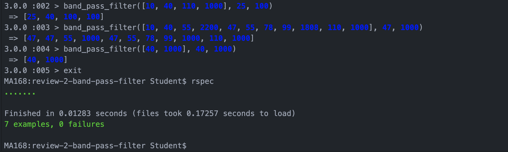

## Client specification

A company that builds digital audio workstations (DAW) plugins. Musicians use their filters to change and modify how their track sounds. Write a band pass filter which raise any frequency to the chosen minimum frequency and lower any frequency to the chosen maximum frequency.

## Aproach:

This specification took a while for me to wrap my head around so I broke down the problem into the below example.

Example:
Method: band_pass_filter()
Musicians can customise their min & max.
3 arguments
 - array - sound wave (composed of frequencies)
 - min frequency - integer
 - max frequency - integer

Next I asked for an example of the expected input output.

[10, 40, 110, 11100], 40, 1000    =>   [40, 40, 110, 1000]

From here I created an input output table starting with the simpliest possible input and output and expanding step by step as stated within the table.

|           INPUT            |        OUTPUT      | Smallest Change|
| -------------------------- | ----------------- | --------------------|
|[40, 40, 110, 1000], 40, 1000    |   [40, 40, 110, 1000] | no change to frequency|
|[10, 40, 110, 1000], 40, 1000    |    [40, 40, 110, 1000] |1 change up to min frequency|
|[40, 40, 110, 1100], 40, 1000    |   [40, 40, 110, 1000] | 1 change down to max frequency |
|[10, 40, 110, 1100], 40, 1000    |   [40, 40, 110, 1000] |1 change up to min frequency & 1 change down to max frequency |
|[40, 40, 110, 1000], 50, 600     |    [50, 50, 110, 600] | frequencies changed to musicians customised frequencies |

I then followed a TDD approach and took each example input as the test I would drive my code development with.

Once I had created the MVP of the band pass filter, the client stated the filter should be able to test up to 44,100 frequencies in under 100 ms. I created a test that mimicked a sounds wave of 44,100 frequencies and as you can see for the image below the filter tests the frequencies in 0.01283 seconds (12.83 ms).

## Reviewer Feedback

Your process demonstrated very good adherence to agile and
test-driven development principles and your process vocalisation was also
quite good! You could improve further by paying attention to your
red-green-refactor cycle iterations’ complexity and refactoring in the
refactor phases. That said, your overall your process was good!

|Level               |        Coding Process|
| -------------------------- | ----------------- |
|**Strong** |Agile Process, Write code that is easy to change  |
| **Steady** | TDD anything, Program Fluency, Debugging, Methodical Approach, Modelling, Justify Code Choices |
| **Improving** | Refactoring|

I had improved in 5/8 categories in just 1 review.
